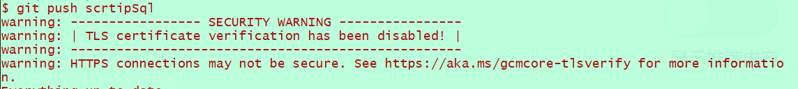
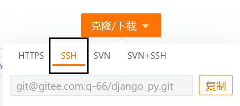
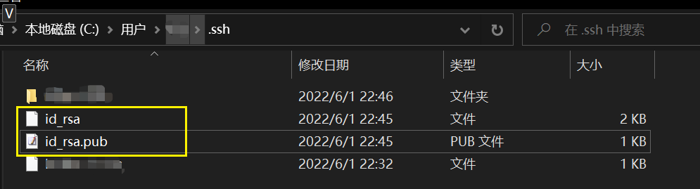
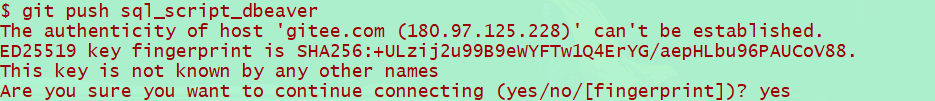

# git SSH免密

-   HTTPS的方式

    

***

1.  通过 `add` 命令添加远程地址
    ```react&#x20;jsx
    # 添加远程项目地址
    $ git remote add blog-front-end git@github.com:296111/blog-front-end.git
    # 查询
    $ git remote -v
    blog-front-end  git@github.com:296111/blog-front-end.git (fetch)
    blog-front-end  git@github.com:296111/blog-front-end.git (push)
    ```
    1.  远程链接选择SSH

        
2.  将生成的**公钥**配置到 云
    1.  生成公私钥方式1：[\[Linux\]ssh-keygen](https://www.wolai.com/enUXZizSYHRBTyoaNkcurW "\[Linux]ssh-keygen")
    2.  会有两个问，有pub结尾的是公钥，另一个则是私钥
    3.  将公钥内容复制到码云(gitee|github)上
3.  在客户端 .ssh文件中写入生成的私钥
    -   注意:如有多个私钥，他需要放在第一个，不然会出现验证失败\[win]
    -   注意:名称一般默认是id\_rsa
    -   \[Win]本地公私钥默认是存放在`%HOMEPATH%``\.ssh`中，或者指定位置，并且默认读取的公私钥名称是`id_rsa`

        生成公私钥方式1：[\[Linux\]ssh-keygen](https://www.wolai.com/enUXZizSYHRBTyoaNkcurW "\[Linux]ssh-keygen")如果使用了`-t`，需要改成id\_rsa，可以改这个，但是没必要。

        
        1.  使用上传下载测试，如果你设置了passphrase (密钥的密钥)每次免密了gitee的登录密码，但是密钥的密码还是要输入

            [https://blog.csdn.net/echo666/article/details/108586663](https://blog.csdn.net/echo666/article/details/108586663 "https://blog.csdn.net/echo666/article/details/108586663")

            
    -   \[Linux]

        私钥默认名称：`id_rsa`

        用户根目录下; /root/.ssh/id\_rsa
        ```python
         .ssh]# ls -1
        authorized_keys
        id_rsa
        known_hosts

        [root@VM-16-5-centos .ssh]# pwd
        /root/.ssh
        ```
    -   示例：有问题不生效  设置当前项目密钥路径`core.sshCommand`、设置全局密钥路径`--global core.sshCommand`
        1.  `git config core.sshCommand "ssh -i /path/to/your/privateKey"`
        2.  `git config --global core.sshCommand "ssh -i /path/to/your/privateKey"`
4.  测试：`ssh -v git@github.com`
    -   成功情况
        ```react&#x20;jsx
        $ ssh -v git@github.com
        OpenSSH_9.3p1, OpenSSL 1.1.1u  30 May 2023
        debug1: Reading configuration data /c/Users/wq/.ssh/config
        debug1: Reading configuration data /etc/ssh/ssh_config
        debug1: Connecting to github.com [192.30.255.113] port 22.
        debug1: Connection established.
        debug1: identity file /c/Users/wq/.ssh/id_rsa type 3
        debug1: identity file /c/Users/wq/.ssh/id_rsa-cert type -1
        debug1: identity file /c/Users/wq/.ssh/id_ecdsa type -1
        debug1: identity file /c/Users/wq/.ssh/id_ecdsa-cert type -1
        debug1: identity file /c/Users/wq/.ssh/id_ecdsa_sk type -1
        debug1: identity file /c/Users/wq/.ssh/id_ecdsa_sk-cert type -1
        debug1: identity file /c/Users/wq/.ssh/id_ed25519 type -1
        debug1: identity file /c/Users/wq/.ssh/id_ed25519-cert type -1
        debug1: identity file /c/Users/wq/.ssh/id_ed25519_sk type -1
        debug1: identity file /c/Users/wq/.ssh/id_ed25519_sk-cert type -1
        debug1: identity file /c/Users/wq/.ssh/id_xmss type -1
        debug1: identity file /c/Users/wq/.ssh/id_xmss-cert type -1
        debug1: identity file /c/Users/wq/.ssh/id_dsa type -1
        debug1: identity file /c/Users/wq/.ssh/id_dsa-cert type -1
        debug1: Local version string SSH-2.0-OpenSSH_9.3
        debug1: Remote protocol version 2.0, remote software version babeld-f3ef7815
        debug1: compat_banner: no match: babeld-f3ef7815
        debug1: Authenticating to github.com:22 as 'git'
        debug1: load_hostkeys: fopen /c/Users/wq/.ssh/known_hosts2: No such file or directory
        debug1: load_hostkeys: fopen /etc/ssh/ssh_known_hosts: No such file or directory
        debug1: load_hostkeys: fopen /etc/ssh/ssh_known_hosts2: No such file or directory
        debug1: SSH2_MSG_KEXINIT sent
        debug1: SSH2_MSG_KEXINIT received
        debug1: kex: algorithm: curve25519-sha256
        debug1: kex: host key algorithm: ssh-ed25519
        debug1: kex: server->client cipher: chacha20-poly1305@openssh.com MAC: <implicit> compression: none
        debug1: kex: client->server cipher: chacha20-poly1305@openssh.com MAC: <implicit> compression: none
        debug1: expecting SSH2_MSG_KEX_ECDH_REPLY
        debug1: SSH2_MSG_KEX_ECDH_REPLY received
        debug1: Server host key: ssh-ed25519 SHA256:+DiY3wvvV6TuJJhbpZisF/zLDA0zPMSvHdkr4UvCOqU
        debug1: load_hostkeys: fopen /c/Users/wq/.ssh/known_hosts2: No such file or directory
        debug1: load_hostkeys: fopen /etc/ssh/ssh_known_hosts: No such file or directory
        debug1: load_hostkeys: fopen /etc/ssh/ssh_known_hosts2: No such file or directory
        debug1: Host 'github.com' is known and matches the ED25519 host key.
        debug1: Found key in /c/Users/wq/.ssh/known_hosts:3
        debug1: rekey out after 134217728 blocks
        debug1: SSH2_MSG_NEWKEYS sent
        debug1: expecting SSH2_MSG_NEWKEYS
        debug1: SSH2_MSG_NEWKEYS received
        debug1: rekey in after 134217728 blocks
        debug1: Will attempt key: /c/Users/wq/.ssh/id_rsa ED25519 SHA256:QxxIqsZQ5FJTEw1B63wKcL9b5gAHh42sn4O03sYk4Qo
        debug1: Will attempt key: /c/Users/wq/.ssh/id_ecdsa
        debug1: Will attempt key: /c/Users/wq/.ssh/id_ecdsa_sk
        debug1: Will attempt key: /c/Users/wq/.ssh/id_ed25519
        debug1: Will attempt key: /c/Users/wq/.ssh/id_ed25519_sk
        debug1: Will attempt key: /c/Users/wq/.ssh/id_xmss
        debug1: Will attempt key: /c/Users/wq/.ssh/id_dsa
        debug1: SSH2_MSG_EXT_INFO received
        debug1: kex_input_ext_info: server-sig-algs=<ssh-ed25519-cert-v01@openssh.com,ecdsa-sha2-nistp521-cert-v01@openssh.com,ecdsa-sha2-nistp384-cert-v01@openssh.com,ecdsa-sha2-nistp256-cert-v01@openssh.com,sk-ssh-ed25519-cert-v01@openssh.com,sk-ecdsa-sha2-nistp256-cert-v01@openssh.com,rsa-sha2-512-cert-v01@openssh.com,rsa-sha2-256-cert-v01@openssh.com,ssh-rsa-cert-v01@openssh.com,sk-ssh-ed25519@openssh.com,sk-ecdsa-sha2-nistp256@openssh.com,ssh-ed25519,ecdsa-sha2-nistp521,ecdsa-sha2-nistp384,ecdsa-sha2-nistp256,rsa-sha2-512,rsa-sha2-256,ssh-rsa>
        debug1: SSH2_MSG_SERVICE_ACCEPT received
        debug1: Authentications that can continue: publickey
        debug1: Next authentication method: publickey
        debug1: Offering public key: /c/Users/wq/.ssh/id_rsa ED25519 SHA256:QxxIqsZQ5FJTEw1B63wKcL9b5gAHh42sn4O03sYk4Qo
        debug1: Server accepts key: /c/Users/wq/.ssh/id_rsa ED25519 SHA256:QxxIqsZQ5FJTEw1B63wKcL9b5gAHh42sn4O03sYk4Qo
        Authenticated to github.com ([192.30.255.113]:22) using "publickey".
        debug1: channel 0: new session [client-session] (inactive timeout: 0)
        debug1: Entering interactive session.
        debug1: pledge: filesystem
        debug1: client_input_global_request: rtype hostkeys-00@openssh.com want_reply 0
        debug1: client_input_hostkeys: searching /c/Users/wq/.ssh/known_hosts for github.com / (none)
        debug1: client_input_hostkeys: searching /c/Users/wq/.ssh/known_hosts2 for github.com / (none)
        debug1: client_input_hostkeys: hostkeys file /c/Users/wq/.ssh/known_hosts2 does not exist
        debug1: client_input_hostkeys: no new or deprecated keys from server
        debug1: pledge: fork
        PTY allo cation request failed on channel 0
        debug1: client_input_channel_req: channel 0 rtype exit-status reply 0
        Hi 296111! You've successfully authenticated, but GitHub does not provide shell access.
        debug1: channel 0: free: client-session, nchannels 1
        Connection to github.com closed. 
        Transferred: sent 2420, received 2588 bytes, in 0.6 seconds
        Bytes per second: sent 4342.8, received 4644.2
        debug1: Exit status 1


        ```
    -   失败情况
        ```react&#x20;jsx
        $ ssh -v git@github.com
        OpenSSH_9.3p1, OpenSSL 1.1.1u  30 May 2023
        debug1: Reading configuration data /c/Users/wq/.ssh/config
        debug1: Reading configuration data /etc/ssh/ssh_config
        debug1: Connecting to github.com [192.30.255.113] port 22.
        debug1: Connection established.
        debug1: identity file /c/Users/wq/.ssh/id_rsa type 3
        debug1: identity file /c/Users/wq/.ssh/id_rsa-cert type -1
        debug1: identity file /c/Users/wq/.ssh/id_ecdsa type -1
        debug1: identity file /c/Users/wq/.ssh/id_ecdsa-cert type -1
        debug1: identity file /c/Users/wq/.ssh/id_ecdsa_sk type -1
        debug1: identity file /c/Users/wq/.ssh/id_ecdsa_sk-cert type -1
        debug1: identity file /c/Users/wq/.ssh/id_ed25519 type -1
        debug1: identity file /c/Users/wq/.ssh/id_ed25519-cert type -1
        debug1: identity file /c/Users/wq/.ssh/id_ed25519_sk type -1
        debug1: identity file /c/Users/wq/.ssh/id_ed25519_sk-cert type -1
        debug1: identity file /c/Users/wq/.ssh/id_xmss type -1
        debug1: identity file /c/Users/wq/.ssh/id_xmss-cert type -1
        debug1: identity file /c/Users/wq/.ssh/id_dsa type -1
        debug1: identity file /c/Users/wq/.ssh/id_dsa-cert type -1
        debug1: Local version string SSH-2.0-OpenSSH_9.3
        debug1: Remote protocol version 2.0, remote software version babeld-f3ef7815
        debug1: compat_banner: no match: babeld-f3ef7815
        debug1: Authenticating to github.com:22 as 'git'
        debug1: load_hostkeys: fopen /c/Users/wq/.ssh/known_hosts2: No such file or directory
        debug1: load_hostkeys: fopen /etc/ssh/ssh_known_hosts: No such file or directory
        debug1: load_hostkeys: fopen /etc/ssh/ssh_known_hosts2: No such file or directory
        debug1: SSH2_MSG_KEXINIT sent
        debug1: SSH2_MSG_KEXINIT received
        debug1: kex: algorithm: curve25519-sha256
        debug1: kex: host key algorithm: ssh-ed25519
        debug1: kex: server->client cipher: chacha20-poly1305@openssh.com MAC: <implicit> compression: none
        debug1: kex: client->server cipher: chacha20-poly1305@openssh.com MAC: <implicit> compression: none
        debug1: expecting SSH2_MSG_KEX_ECDH_REPLY
        debug1: SSH2_MSG_KEX_ECDH_REPLY received
        debug1: Server host key: ssh-ed25519 SHA256:+DiY3wvvV6TuJJhbpZisF/zLDA0zPMSvHdkr4UvCOqU
        debug1: load_hostkeys: fopen /c/Users/wq/.ssh/known_hosts2: No such file or directory
        debug1: load_hostkeys: fopen /etc/ssh/ssh_known_hosts: No such file or directory
        debug1: load_hostkeys: fopen /etc/ssh/ssh_known_hosts2: No such file or directory
        debug1: Host 'github.com' is known and matches the ED25519 host key.
        debug1: Found key in /c/Users/wq/.ssh/known_hosts:3
        debug1: rekey out after 134217728 blocks
        debug1: SSH2_MSG_NEWKEYS sent
        debug1: expecting SSH2_MSG_NEWKEYS
        debug1: SSH2_MSG_NEWKEYS received
        debug1: rekey in after 134217728 blocks
        debug1: Will attempt key: /c/Users/wq/.ssh/id_rsa ED25519 SHA256:QxxIqsZQ5FJTEw1B63wKcL9b5gAHh42sn4O03sYk4Qo
        debug1: Will attempt key: /c/Users/wq/.ssh/id_ecdsa
        debug1: Will attempt key: /c/Users/wq/.ssh/id_ecdsa_sk
        debug1: Will attempt key: /c/Users/wq/.ssh/id_ed25519
        debug1: Will attempt key: /c/Users/wq/.ssh/id_ed25519_sk
        debug1: Will attempt key: /c/Users/wq/.ssh/id_xmss
        debug1: Will attempt key: /c/Users/wq/.ssh/id_dsa
        debug1: SSH2_MSG_EXT_INFO received
        debug1: kex_input_ext_info: server-sig-algs=<ssh-ed25519-cert-v01@openssh.com,ecdsa-sha2-nistp521-cert-v01@openssh.com,ecdsa-sha2-nistp384-cert-v01@openssh.com,ecdsa-sha2-nistp256-cert-v01@openssh.com,sk-ssh-ed25519-cert-v01@openssh.com,sk-ecdsa-sha2-nistp256-cert-v01@openssh.com,rsa-sha2-512-cert-v01@openssh.com,rsa-sha2-256-cert-v01@openssh.com,ssh-rsa-cert-v01@openssh.com,sk-ssh-ed25519@openssh.com,sk-ecdsa-sha2-nistp256@openssh.com,ssh-ed25519,ecdsa-sha2-nistp521,ecdsa-sha2-nistp384,ecdsa-sha2-nistp256,rsa-sha2-512,rsa-sha2-256,ssh-rsa>
        debug1: SSH2_MSG_SERVICE_ACCEPT received
        debug1: Authentications that can continue: publickey
        debug1: Next authentication method: publickey
        debug1: Offering public key: /c/Users/wq/.ssh/id_rsa ED25519 SHA256:QxxIqsZQ5FJTEw1B63wKcL9b5gAHh42sn4O03sYk4Qo
        debug1: Authentications that can continue: publickey
        debug1: Trying private key: /c/Users/wq/.ssh/id_ecdsa
        debug1: Trying private key: /c/Users/wq/.ssh/id_ecdsa_sk
        debug1: Trying private key: /c/Users/wq/.ssh/id_ed25519
        debug1: Trying private key: /c/Users/wq/.ssh/id_ed25519_sk
        debug1: Trying private key: /c/Users/wq/.ssh/id_xmss
        debug1: Trying private key: /c/Users/wq/.ssh/id_dsa
        debug1: No more authentication methods to try.
        git@github.com: Permission denied (publickey).

        ```

## 示例

-   示例：修改密钥路径的方式 \[git ssh]
    -   示例：有问题不生效  设置当前项目密钥路径`core.sshCommand`、设置全局密钥路径`--global core.sshCommand`
        1.  `git config core.sshCommand "ssh -i /path/to/your/privateKey"`
        2.  `git config --global core.sshCommand "ssh -i /path/to/your/privateKey"`
    -   示例：直接在项目中的`.git`文件夹中编辑`config`
        ```纯文本
        ...
        [core]
        ...
          sshCommand = ssh -i C:/Users/wq/.ssh/id_rsa
        ...
        ```

## QE

-   \[Q]
    -   The authenticity of host '[gitee.com](http://gitee.com "gitee.com") (180.97.125.228)' can't be established.
        ED25519 key fingerprint is SHA256:+ULzij2u99B9eWYFTw1Q4ErYG/aepHLbu96PAUCoV88.
        This key is not known by any other names
        Are you sure you want to continue connecting (yes/no/\[fingerprint])?

        
