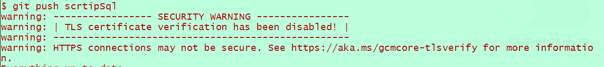
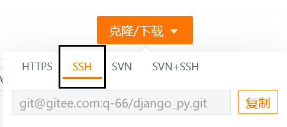
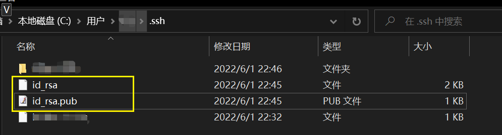
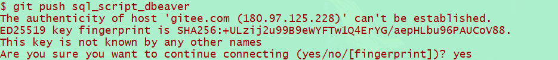

# git SSH免密

-   \[Win]ssh路径
    %HOMEPATH%\\.sshssh配置相关路径
    %HOMEPATH%\\.ssh\configSSH配置
    -   示例：
        ```纯文本
        Host 1.1.1.2
          HostName qwertyui.vip        # 别名
          Port 19982                   # 端口
          User root                    # 用户名

        Host github.com                                              # 登录主机SSH的域名或IP
          IdentityFile "F:\Profession\doc\key\gitee&github\id_rsa"   # 指定密钥路径, 不指定默认为%HOMEPATH%\.ssh\id-rsa
        ```
    %HOMEPATH%\\.ssh\id-rsaSSH密钥存放文件
    %HOMEPATH%\\.ssh
    %HOMEPATH%\\.ssh\config
    IdentityFile
    %HOMEPATH%\\.ssh\id-rsa

***

-   HTTPS的方式


    

***

1.  通过 `add` 命令添加远程地址
    ```react&#x20;jsx
    # 添加远程项目地址
    $ git remote add blog-front-end git@github.com:296111/blog-front-end.git
    # 查询
    $ git remote -v
    blog-front-end  git@github.com:296111/blog-front-end.git (fetch)
    blog-front-end  git@github.com:296111/blog-front-end.git (push)
    ```
    1.  远程链接选择SSH

        
2.  将生成的**公钥**配置到 云
    1.  生成公私钥方式1：[\[Linux\]ssh-keygen](\[Linux]ssh-keygen_enUXZizSYHRBTyoaNkcurW.md "\[Linux]ssh-keygen")
    2.  会有两个问，有pub结尾的是公钥，另一个则是私钥
    3.  将公钥内容复制到码云(gitee|github)上
3.  在客户端 id-rsa文件中写入生成的私钥 \[%HOMEPATH%\\.ssh\id-rsa]
    -   注意:如有多个私钥，他需要放在第一个，不然会出现验证失败\[win]
    -   注意:名称一般默认是id\_rsa
    ***
    -   \[Win]本地公私钥默认是存放在`%HOMEPATH%``\.ssh`中，或者指定位置，并且默认读取的公私钥名称是`id_rsa`

        生成公私钥方式1：[\[Linux\]ssh-keygen](\[Linux]ssh-keygen_enUXZizSYHRBTyoaNkcurW.md "\[Linux]ssh-keygen")如果使用了`-t`，需要改成id\_rsa，可以改这个，但是没必要。

        
        1.  使用上传下载测试，如果你设置了passphrase (密钥的密钥)每次免密了gitee的登录密码，但是密钥的密码还是要输入

            [https://blog.csdn.net/echo666/article/details/108586663](https://blog.csdn.net/echo666/article/details/108586663 "https://blog.csdn.net/echo666/article/details/108586663")

            
    -   \[Linux]

        私钥默认名称：`id_rsa`

        用户根目录下; /root/.ssh/id\_rsa
        ```python
         .ssh]# ls -1
        authorized_keys
        id_rsa
        known_hosts

        [root@VM-16-5-centos .ssh]# pwd
        /root/.ssh
        ```
    -   示例：有问题不生效  设置当前项目密钥路径`core.sshCommand`、设置全局密钥路径`--global core.sshCommand`
        > windows不建议修改密钥默认路径
        1.  `git config core.sshCommand "ssh -i /path/to/your/privateKey"`
        2.  `git config --global core.sshCommand "ssh -i /path/to/your/privateKey"`
        -   设置完成检查配置：`git config --global core.sshCommand`
        -   恢复默认配置：`git config --global --unset core.sshCommand`

            要恢复SSH密钥路径的默认配置，你可以按照以下步骤操作：
            1.  打开 Git Bash 或 Windows 终端。
            2.  运行以下命令，将SSH命令配置恢复为默认值：
                ```bash
                git config --global --unset core.sshCommand
                ```
                这会将`core.sshCommand`配置从全局Git配置中删除，从而恢复SSH命令的默认配置。
            3.  确认SSH配置已被删除，运行以下命令检查：
                ```bash
                git config --global core.sshCommand
                ```
                如果命令返回空白行，说明`core.sshCommand`配置已成功删除，SSH密钥路径将恢复为默认配置。
            现在，SSH密钥路径将不再使用自定义的SSH命令，而会回到默认的配置中。你可以重新测试SSH连接以确保一切正常。如果有其他问题或需要进一步帮助，请随时告诉我。
4.  测试：`ssh -v git@github.com`
    -   成功情况
        ```react&#x20;jsx
        $ ssh -v git@github.com
        OpenSSH_9.3p1, OpenSSL 1.1.1u  30 May 2023
        debug1: Reading configuration data /c/Users/wq/.ssh/config
        debug1: Reading configuration data /etc/ssh/ssh_config
        debug1: Connecting to github.com [192.30.255.113] port 22.
        debug1: Connection established.
        debug1: identity file /c/Users/wq/.ssh/id_rsa type 3
        debug1: identity file /c/Users/wq/.ssh/id_rsa-cert type -1
        debug1: identity file /c/Users/wq/.ssh/id_ecdsa type -1
        debug1: identity file /c/Users/wq/.ssh/id_ecdsa-cert type -1
        debug1: identity file /c/Users/wq/.ssh/id_ecdsa_sk type -1
        debug1: identity file /c/Users/wq/.ssh/id_ecdsa_sk-cert type -1
        debug1: identity file /c/Users/wq/.ssh/id_ed25519 type -1
        debug1: identity file /c/Users/wq/.ssh/id_ed25519-cert type -1
        debug1: identity file /c/Users/wq/.ssh/id_ed25519_sk type -1
        debug1: identity file /c/Users/wq/.ssh/id_ed25519_sk-cert type -1
        debug1: identity file /c/Users/wq/.ssh/id_xmss type -1
        debug1: identity file /c/Users/wq/.ssh/id_xmss-cert type -1
        debug1: identity file /c/Users/wq/.ssh/id_dsa type -1
        debug1: identity file /c/Users/wq/.ssh/id_dsa-cert type -1
        debug1: Local version string SSH-2.0-OpenSSH_9.3
        debug1: Remote protocol version 2.0, remote software version babeld-f3ef7815
        debug1: compat_banner: no match: babeld-f3ef7815
        debug1: Authenticating to github.com:22 as 'git'
        debug1: load_hostkeys: fopen /c/Users/wq/.ssh/known_hosts2: No such file or directory
        debug1: load_hostkeys: fopen /etc/ssh/ssh_known_hosts: No such file or directory
        debug1: load_hostkeys: fopen /etc/ssh/ssh_known_hosts2: No such file or directory
        debug1: SSH2_MSG_KEXINIT sent
        debug1: SSH2_MSG_KEXINIT received
        debug1: kex: algorithm: curve25519-sha256
        debug1: kex: host key algorithm: ssh-ed25519
        debug1: kex: server->client cipher: chacha20-poly1305@openssh.com MAC: <implicit> compression: none
        debug1: kex: client->server cipher: chacha20-poly1305@openssh.com MAC: <implicit> compression: none
        debug1: expecting SSH2_MSG_KEX_ECDH_REPLY
        debug1: SSH2_MSG_KEX_ECDH_REPLY received
        debug1: Server host key: ssh-ed25519 SHA256:+DiY3wvvV6TuJJhbpZisF/zLDA0zPMSvHdkr4UvCOqU
        debug1: load_hostkeys: fopen /c/Users/wq/.ssh/known_hosts2: No such file or directory
        debug1: load_hostkeys: fopen /etc/ssh/ssh_known_hosts: No such file or directory
        debug1: load_hostkeys: fopen /etc/ssh/ssh_known_hosts2: No such file or directory
        debug1: Host 'github.com' is known and matches the ED25519 host key.
        debug1: Found key in /c/Users/wq/.ssh/known_hosts:3
        debug1: rekey out after 134217728 blocks
        debug1: SSH2_MSG_NEWKEYS sent
        debug1: expecting SSH2_MSG_NEWKEYS
        debug1: SSH2_MSG_NEWKEYS received
        debug1: rekey in after 134217728 blocks
        debug1: Will attempt key: /c/Users/wq/.ssh/id_rsa ED25519 SHA256:QxxIqsZQ5FJTEw1B63wKcL9b5gAHh42sn4O03sYk4Qo
        debug1: Will attempt key: /c/Users/wq/.ssh/id_ecdsa
        debug1: Will attempt key: /c/Users/wq/.ssh/id_ecdsa_sk
        debug1: Will attempt key: /c/Users/wq/.ssh/id_ed25519
        debug1: Will attempt key: /c/Users/wq/.ssh/id_ed25519_sk
        debug1: Will attempt key: /c/Users/wq/.ssh/id_xmss
        debug1: Will attempt key: /c/Users/wq/.ssh/id_dsa
        debug1: SSH2_MSG_EXT_INFO received
        debug1: kex_input_ext_info: server-sig-algs=<ssh-ed25519-cert-v01@openssh.com,ecdsa-sha2-nistp521-cert-v01@openssh.com,ecdsa-sha2-nistp384-cert-v01@openssh.com,ecdsa-sha2-nistp256-cert-v01@openssh.com,sk-ssh-ed25519-cert-v01@openssh.com,sk-ecdsa-sha2-nistp256-cert-v01@openssh.com,rsa-sha2-512-cert-v01@openssh.com,rsa-sha2-256-cert-v01@openssh.com,ssh-rsa-cert-v01@openssh.com,sk-ssh-ed25519@openssh.com,sk-ecdsa-sha2-nistp256@openssh.com,ssh-ed25519,ecdsa-sha2-nistp521,ecdsa-sha2-nistp384,ecdsa-sha2-nistp256,rsa-sha2-512,rsa-sha2-256,ssh-rsa>
        debug1: SSH2_MSG_SERVICE_ACCEPT received
        debug1: Authentications that can continue: publickey
        debug1: Next authentication method: publickey
        debug1: Offering public key: /c/Users/wq/.ssh/id_rsa ED25519 SHA256:QxxIqsZQ5FJTEw1B63wKcL9b5gAHh42sn4O03sYk4Qo
        debug1: Server accepts key: /c/Users/wq/.ssh/id_rsa ED25519 SHA256:QxxIqsZQ5FJTEw1B63wKcL9b5gAHh42sn4O03sYk4Qo
        Authenticated to github.com ([192.30.255.113]:22) using "publickey".
        debug1: channel 0: new session [client-session] (inactive timeout: 0)
        debug1: Entering interactive session.
        debug1: pledge: filesystem
        debug1: client_input_global_request: rtype hostkeys-00@openssh.com want_reply 0
        debug1: client_input_hostkeys: searching /c/Users/wq/.ssh/known_hosts for github.com / (none)
        debug1: client_input_hostkeys: searching /c/Users/wq/.ssh/known_hosts2 for github.com / (none)
        debug1: client_input_hostkeys: hostkeys file /c/Users/wq/.ssh/known_hosts2 does not exist
        debug1: client_input_hostkeys: no new or deprecated keys from server
        debug1: pledge: fork
        PTY allo cation request failed on channel 0
        debug1: client_input_channel_req: channel 0 rtype exit-status reply 0
        Hi 296111! You've successfully authenticated, but GitHub does not provide shell access.
        debug1: channel 0: free: client-session, nchannels 1
        Connection to github.com closed. 
        Transferred: sent 2420, received 2588 bytes, in 0.6 seconds
        Bytes per second: sent 4342.8, received 4644.2
        debug1: Exit status 1


        ```
    -   失败情况
        -   情况1
            ```react&#x20;jsx
            $ ssh -v git@github.com
            OpenSSH_9.3p1, OpenSSL 1.1.1u  30 May 2023
            debug1: Reading configuration data /c/Users/wq/.ssh/config
            debug1: Reading configuration data /etc/ssh/ssh_config
            debug1: Connecting to github.com [192.30.255.113] port 22.
            debug1: Connection established.
            debug1: identity file /c/Users/wq/.ssh/id_rsa type 3
            debug1: identity file /c/Users/wq/.ssh/id_rsa-cert type -1
            debug1: identity file /c/Users/wq/.ssh/id_ecdsa type -1
            debug1: identity file /c/Users/wq/.ssh/id_ecdsa-cert type -1
            debug1: identity file /c/Users/wq/.ssh/id_ecdsa_sk type -1
            debug1: identity file /c/Users/wq/.ssh/id_ecdsa_sk-cert type -1
            debug1: identity file /c/Users/wq/.ssh/id_ed25519 type -1
            debug1: identity file /c/Users/wq/.ssh/id_ed25519-cert type -1
            debug1: identity file /c/Users/wq/.ssh/id_ed25519_sk type -1
            debug1: identity file /c/Users/wq/.ssh/id_ed25519_sk-cert type -1
            debug1: identity file /c/Users/wq/.ssh/id_xmss type -1
            debug1: identity file /c/Users/wq/.ssh/id_xmss-cert type -1
            debug1: identity file /c/Users/wq/.ssh/id_dsa type -1
            debug1: identity file /c/Users/wq/.ssh/id_dsa-cert type -1
            debug1: Local version string SSH-2.0-OpenSSH_9.3
            debug1: Remote protocol version 2.0, remote software version babeld-f3ef7815
            debug1: compat_banner: no match: babeld-f3ef7815
            debug1: Authenticating to github.com:22 as 'git'
            debug1: load_hostkeys: fopen /c/Users/wq/.ssh/known_hosts2: No such file or directory
            debug1: load_hostkeys: fopen /etc/ssh/ssh_known_hosts: No such file or directory
            debug1: load_hostkeys: fopen /etc/ssh/ssh_known_hosts2: No such file or directory
            debug1: SSH2_MSG_KEXINIT sent
            debug1: SSH2_MSG_KEXINIT received
            debug1: kex: algorithm: curve25519-sha256
            debug1: kex: host key algorithm: ssh-ed25519
            debug1: kex: server->client cipher: chacha20-poly1305@openssh.com MAC: <implicit> compression: none
            debug1: kex: client->server cipher: chacha20-poly1305@openssh.com MAC: <implicit> compression: none
            debug1: expecting SSH2_MSG_KEX_ECDH_REPLY
            debug1: SSH2_MSG_KEX_ECDH_REPLY received
            debug1: Server host key: ssh-ed25519 SHA256:+DiY3wvvV6TuJJhbpZisF/zLDA0zPMSvHdkr4UvCOqU
            debug1: load_hostkeys: fopen /c/Users/wq/.ssh/known_hosts2: No such file or directory
            debug1: load_hostkeys: fopen /etc/ssh/ssh_known_hosts: No such file or directory
            debug1: load_hostkeys: fopen /etc/ssh/ssh_known_hosts2: No such file or directory
            debug1: Host 'github.com' is known and matches the ED25519 host key.
            debug1: Found key in /c/Users/wq/.ssh/known_hosts:3
            debug1: rekey out after 134217728 blocks
            debug1: SSH2_MSG_NEWKEYS sent
            debug1: expecting SSH2_MSG_NEWKEYS
            debug1: SSH2_MSG_NEWKEYS received
            debug1: rekey in after 134217728 blocks
            debug1: Will attempt key: /c/Users/wq/.ssh/id_rsa ED25519 SHA256:QxxIqsZQ5FJTEw1B63wKcL9b5gAHh42sn4O03sYk4Qo
            debug1: Will attempt key: /c/Users/wq/.ssh/id_ecdsa
            debug1: Will attempt key: /c/Users/wq/.ssh/id_ecdsa_sk
            debug1: Will attempt key: /c/Users/wq/.ssh/id_ed25519
            debug1: Will attempt key: /c/Users/wq/.ssh/id_ed25519_sk
            debug1: Will attempt key: /c/Users/wq/.ssh/id_xmss
            debug1: Will attempt key: /c/Users/wq/.ssh/id_dsa
            debug1: SSH2_MSG_EXT_INFO received
            debug1: kex_input_ext_info: server-sig-algs=<ssh-ed25519-cert-v01@openssh.com,ecdsa-sha2-nistp521-cert-v01@openssh.com,ecdsa-sha2-nistp384-cert-v01@openssh.com,ecdsa-sha2-nistp256-cert-v01@openssh.com,sk-ssh-ed25519-cert-v01@openssh.com,sk-ecdsa-sha2-nistp256-cert-v01@openssh.com,rsa-sha2-512-cert-v01@openssh.com,rsa-sha2-256-cert-v01@openssh.com,ssh-rsa-cert-v01@openssh.com,sk-ssh-ed25519@openssh.com,sk-ecdsa-sha2-nistp256@openssh.com,ssh-ed25519,ecdsa-sha2-nistp521,ecdsa-sha2-nistp384,ecdsa-sha2-nistp256,rsa-sha2-512,rsa-sha2-256,ssh-rsa>
            debug1: SSH2_MSG_SERVICE_ACCEPT received
            debug1: Authentications that can continue: publickey
            debug1: Next authentication method: publickey
            debug1: Offering public key: /c/Users/wq/.ssh/id_rsa ED25519 SHA256:QxxIqsZQ5FJTEw1B63wKcL9b5gAHh42sn4O03sYk4Qo
            debug1: Authentications that can continue: publickey
            debug1: Trying private key: /c/Users/wq/.ssh/id_ecdsa
            debug1: Trying private key: /c/Users/wq/.ssh/id_ecdsa_sk
            debug1: Trying private key: /c/Users/wq/.ssh/id_ed25519
            debug1: Trying private key: /c/Users/wq/.ssh/id_ed25519_sk
            debug1: Trying private key: /c/Users/wq/.ssh/id_xmss
            debug1: Trying private key: /c/Users/wq/.ssh/id_dsa
            debug1: No more authentication methods to try.
            git@github.com: Permission denied (publickey).

            ```
        -   情况2：说路径权限台太开放 \[Win]
            ```纯文本
            $ ssh -v git@github.com
            OpenSSH_for_Windows_7.7p1, LibreSSL 2.6.5
            debug1: Reading configuration data C:\\Users\\qusay/.ssh/config
            debug1: C:\\Users\\qusay/.ssh/config line 23: Applying options for github.com
            Pseudo-terminal will not be allocated because stdin is not a terminal.
            debug1: Connecting to github.com [20.205.243.166] port 22.
            debug1: Connection established.
            debug1: identity file F:\\Profession\\doc\\key\\gitee&github\\id_rsa type 0
            debug1: key_load_public: No such file or directory
            debug1: identity file F:\\Profession\\doc\\key\\gitee&github\\id_rsa-cert type -1
            debug1: Local version string SSH-2.0-OpenSSH_for_Windows_7.7
            debug1: Remote protocol version 2.0, remote software version babeld-dd067d10
            debug1: no match: babeld-dd067d10
            debug1: Authenticating to github.com:22 as 'git'
            debug1: SSH2_MSG_KEXINIT sent
            debug1: SSH2_MSG_KEXINIT received
            debug1: kex: algorithm: curve25519-sha256
            debug1: kex: host key algorithm: ecdsa-sha2-nistp256
            debug1: kex: server->client cipher: chacha20-poly1305@openssh.com MAC: <implicit> compression: none
            debug1: kex: client->server cipher: chacha20-poly1305@openssh.com MAC: <implicit> compression: none
            debug1: expecting SSH2_MSG_KEX_ECDH_REPLY
            debug1: Server host key: ecdsa-sha2-nistp256 SHA256:p2QAMXNIC1TJYWeIOttrVc98/R1BUFWu3/LiyKgUfQM
            debug1: Host 'github.com' is known and matches the ECDSA host key.
            debug1: Found key in C:\\Users\\qusay/.ssh/known_hosts:10
            debug1: rekey after 134217728 blocks
            debug1: SSH2_MSG_NEWKEYS sent
            debug1: expecting SSH2_MSG_NEWKEYS
            debug1: SSH2_MSG_NEWKEYS received
            debug1: rekey after 134217728 blocks
            debug1: pubkey_prepare: ssh_get_authentication_socket: No such file or directory
            debug1: SSH2_MSG_EXT_INFO received
            debug1: kex_input_ext_info: server-sig-algs=<ssh-ed25519-cert-v01@openssh.com,ecdsa-sha2-nistp521-cert-v01@openssh.com,ecdsa-sha2-nistp384-cert-v01@openssh.com,ecdsa-sha2-nistp256-cert-v01@openssh.com,sk-ssh-ed25519-cert-v01@openssh.com,sk-ecdsa-sha2-nistp256-cert-v01@openssh.com,rsa-sha2-512-cert-v01@openssh.com,rsa-sha2-256-cert-v01@openssh.com,ssh-rsa-cert-v01@openssh.com,sk-ssh-ed25519@openssh.com,sk-ecdsa-sha2-nistp256@openssh.com,ssh-ed25519,ecdsa-sha2-nistp521,ecdsa-sha2-nistp384,ecdsa-sha2-nistp256,rsa-sha2-512,rsa-sha2-256,ssh-rsa>
            debug1: SSH2_MSG_SERVICE_ACCEPT received
            debug1: Authentications that can continue: publickey
            debug1: Next authentication method: publickey
            debug1: Offering public key: RSA SHA256:TOb1iI0OBgUjFrTTw2uE3C7DCB94DEADIS9muGEag/s F:\\Profession\\doc\\key\\gitee&github\\id_rsa
            debug1: Server accepts key: pkalg rsa-sha2-512 blen 535
            @@@@@@@@@@@@@@@@@@@@@@@@@@@@@@@@@@@@@@@@@@@@@@@@@@@@@@@@@@@
            @         WARNING: UNPROTECTED PRIVATE KEY FILE!          @
            @@@@@@@@@@@@@@@@@@@@@@@@@@@@@@@@@@@@@@@@@@@@@@@@@@@@@@@@@@@
            Permissions for 'F:\\Profession\\doc\\key\\gitee&github\\id_rsa' are too open.
            It is required that your private key files are NOT accessible by others.
            This private key will be ignored.
            Load key "F:\\Profession\\doc\\key\\gitee&github\\id_rsa": bad permissions
            debug1: No more authentication methods to try.
            git@github.com: Permission denied (publickey).

            ```
    -   失败情况的解决办法
        -   解决办法：情况2：说路径权限台太开放 \[Win]
            -   如果是windows，且是非默认路径直接删除指定(删除IdentityFile)，使用默认路径，在默认路径中写入密钥既可。

                \[window的改权限试过，但是没用很无语，还是直接不指定密钥路径来的实在，不然在Linux中直接一行命令就可以了]

## 示例

-   示例：修改密钥路径的方式 \[git ssh]
    -   示例：有问题不生效  设置当前项目密钥路径`core.sshCommand`、设置全局密钥路径`--global core.sshCommand`
        > windows不建议修改密钥默认路径
        1.  `git config core.sshCommand "ssh -i /path/to/your/privateKey"`
        2.  `git config --global core.sshCommand "ssh -i /path/to/your/privateKey"`
        -   设置完成检查配置：`git config --global core.sshCommand`
        -   恢复默认配置：`git config --global --unset core.sshCommand`
            要恢复SSH密钥路径的默认配置，你可以按照以下步骤操作：
            1.  打开 Git Bash 或 Windows 终端。
            2.  运行以下命令，将SSH命令配置恢复为默认值：
                ```bash
                git config --global --unset core.sshCommand
                ```
                这会将`core.sshCommand`配置从全局Git配置中删除，从而恢复SSH命令的默认配置。
            3.  确认SSH配置已被删除，运行以下命令检查：
                ```bash
                git config --global core.sshCommand
                ```
                如果命令返回空白行，说明`core.sshCommand`配置已成功删除，SSH密钥路径将恢复为默认配置。
            现在，SSH密钥路径将不再使用自定义的SSH命令，而会回到默认的配置中。你可以重新测试SSH连接以确保一切正常。如果有其他问题或需要进一步帮助，请随时告诉我。
    -   示例：直接在项目中的`.git`文件夹中编辑`config`
        ```纯文本
        ...
        [core]
        ...
          sshCommand = ssh -i C:/Users/wq/.ssh/id_rsa
        ...
        ```

## QE

-   \[Q]
    -   The authenticity of host '[gitee.com](http://gitee.com "gitee.com") (180.97.125.228)' can't be established.
        ED25519 key fingerprint is SHA256:+ULzij2u99B9eWYFTw1Q4ErYG/aepHLbu96PAUCoV88.
        This key is not known by any other names
        Are you sure you want to continue connecting (yes/no/\[fingerprint])?

        

