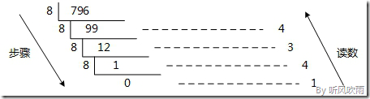
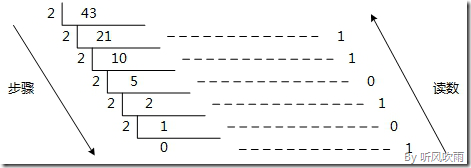
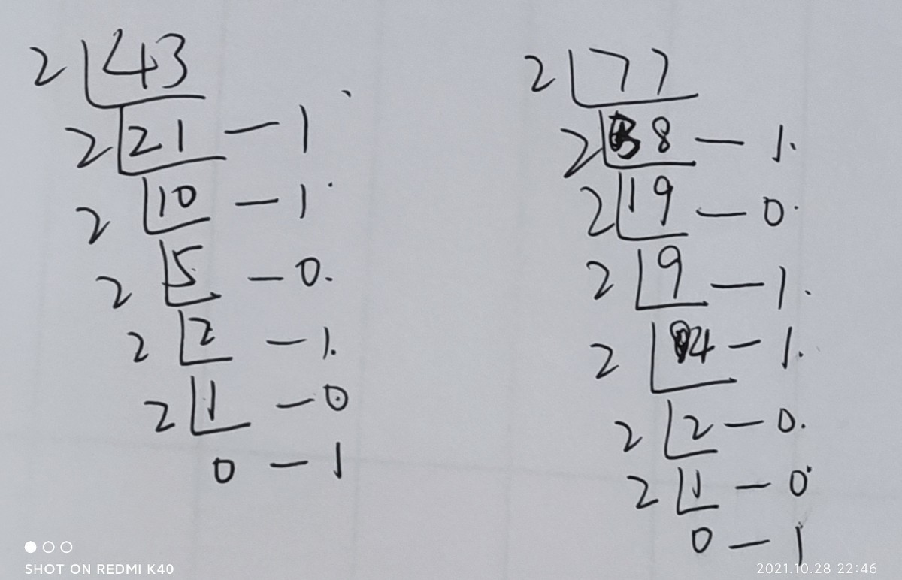
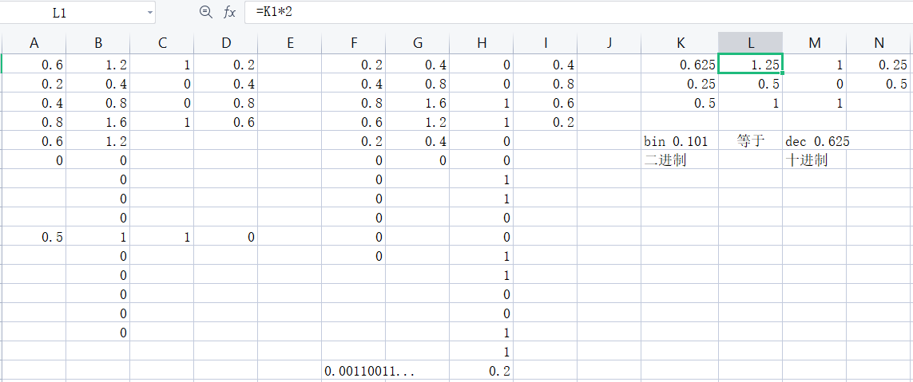

# 进制

[二进制(BIN)](二进制\(BIN\)_7Z9xxxYqwHEprYrRWQigcX.md "二进制(BIN)")

[八进制(OCT)](八进制\(OCT\)_nnZ2GiSoqMwVtgEtsqHVii.md "八进制(OCT)")

[十进制(DEC)](十进制\(DEC\)_gz18zFgq6W56Q8ZoT8dY6v.md "十进制(DEC)")

[十六进制(HEX)](十六进制\(HEX\)_3UFrVUTjLPzYo4DbWAgbgp.md "十六进制(HEX)")

## 进制的表达

[十六进制(HEX)](十六进制\(HEX\)_3UFrVUTjLPzYo4DbWAgbgp.md "十六进制(HEX)")前缀`0x`、[八进制(OCT)](八进制\(OCT\)_nnZ2GiSoqMwVtgEtsqHVii.md "八进制(OCT)")前缀`0`、[二进制(BIN)](二进制\(BIN\)_7Z9xxxYqwHEprYrRWQigcX.md "二进制(BIN)")前缀`0b`(非标准)

`0x`在[C 语言](<C 语言_2gyK7vBbPrNiTayWcUD8NG.md> "C 语言")、C++、Shell、[Python](Python_ifd8apTqYkKuJg39xs7qN8.md "Python")、Java语言及其他相近的语言使用字首“0x”表示十六进制数，例如“0x5A3”。开头的“0”令解析器更易辨认数，而“x”则代表十六进制（就如“O”代表八进制）。在“0x”中的“x”可以大写或小写。对于字符量C语言中则以x+两位十六进制数的方式表示，如xFF。

示例：一个字节的uft8表示的unicode 码范围为(0 \~`0x`7F) 0\~127 *（表示前128个字符，也就是*[ASCII](ASCII_4xGcAN81wEtYREcNDpKWvH.md "ASCII")* 所包含的字符*。

&#x20;

`0x`

`0`

`0b`

## 进制换算

<https://www.cnblogs.com/gaizai/p/4233780.html#_labelConvert10>

#### 例：将二进制的(101011)B转换为十进制的步骤如下

1.  第0位 1 x 2^0 = 1；
2.  第1位 1 x 2^1 = 2；
3.  第2位 0 x 2^2 = 0；
4.  第3位 1 x 2^3 = 8；
5.  第4位 0 x 2^4 = 0；
6.  第5位 1 x 2^5 = 32；
7.  读数，把结果值相加，1+2+0+8+0+32=43，即(101011)B=(43)D。

#### 例：将八进制的(53)O转换为十进制的步骤如下：

1.  第0位 3 x 8^0 = 3；
2.  第1位 5 x 8^1 = 40；
3.  读数，把结果值相加，3+40=43，即(53)O=(43)D。

#### 例：十进制转换为八进制

例：十进制转二进制

例：十进制小数转二进制

十进制乘以2得出的值取个位数，小数继续乘以2，直到等于1或者循环结束

0.625 = 0b 0.101

0.5 = 0b 0.1

